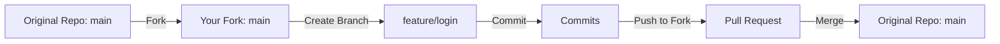

# 🛡️ SentinelR: AI-Enhanced Windows System Auditor

A cross-functional project that combines **PowerShell**, **R**, and **RShiny** to scan, analyze, and visualize real-time Windows system performance and security health — built to be usable by both technical and non-technical users.

---

## 📌 Table of Contents

* [📖 Summary](#📖-summary)
* [🚀 Features](#🚀-features)
* [📦 Tech Stack](#📦-tech-stack)
* [📚 Installed Packages](#📚-installed-packages)
* [🧠 Why This Matters](#🧠-why-this-matters)
* [🔧 PowerShell Audit Script](#🔧-powershell-audit-script)
* [🧪 RShiny Dashboard Code](#🧪-rshiny-dashboard-code)
* [📁 File Structure](#📁-file-structure)
* [📝 UTF-8 Compatibility Fix](#📝-utf-8-compatibility-fix)
* [✅ Conclusion](#✅-conclusion)
* [🧽 Forking Workflow Diagram](#🧽-forking-workflow-diagram)

---

## 📖 Summary

**SentinelR** is a mini platform that performs a real-time audit of your Windows system using PowerShell, transforms that data into structured JSON, then renders it in an interactive RShiny dashboard.

It’s built to help:

* 🧑‍💻 New developers learn real-world scripting, parsing, and UI-building
* 🧠 Data scientists visualize local system health without needing sysadmin tools
* 📊 Non-technical stakeholders gain insight into machine status

---

## 🚀 Features

* ✔️ Automated system scan with PowerShell
* ✔️ Clean JSON output for interoperability
* ✔️ Interactive web dashboard via RShiny
* ✔️ Visual tabs for CPU, Services, Defender, Tasks
* ✔️ PowerBI-style dark UI with Bootstrap 5
* ✔️ Future-ready for AI features like GPT explanations or auto-remediation

---

## 📦 Tech Stack


**PowerShell** — Used to scan the system and export structured audit reports.


**R** — Processes, filters, and transforms the JSON report into visual summaries.


**RShiny** — Provides a real-time web-based dashboard interface for users.


**JSON** — Used as the universal format to move data between PowerShell and R.

---

## 📚 Installed Packages


**jsonlite** — Reads and parses PowerShell's structured JSON output.


**DT** — Enhances RShiny with filterable, paginated data tables.


**bslib** — Adds dark-mode Bootstrap 5 themes for a modern look.


**shiny** — Framework for building interactive web applications in RStudio.

---

## 🧠 Why This Matters

Today’s systems are complex. It’s not enough to just run diagnostic commands — you need visibility, automation, and smart insights. This project bridges the gap between:

* 🔧 System scripting
* 📊 Data visualization
* 🧠 AI-readiness

With SentinelR:

* IT admins can audit performance and security without 3rd-party tools
* Business users can see what’s running under the hood
* Developers and analysts can expand it with AI (e.g., GPT alerts or auto-fixes)

This project can scale into a DevOps monitoring tool, security scanner, or intelligent assistant.

---

## 🔧 PowerShell Audit Script

Save as: `powershell/sentinel-audit.ps1`

```powershell
$homeFolder = [Environment]::GetFolderPath("MyDocuments")
$projectRoot = Join-Path $homeFolder "SentinelR"
$outputPath = Join-Path $projectRoot "output"

if (!(Test-Path $outputPath)) {
    New-Item -Path $outputPath -ItemType Directory -Force | Out-Null
}

$report = @{}

$report["HighCPUProcesses"] = Get-Process |
    Where-Object { $_.CPU -gt 200 } |
    Select-Object Name, Id, CPU

$report["AutoServicesNotRunning"] = Get-Service |
    Where-Object { $_.StartType -eq 'Automatic' -and $_.Status -ne 'Running' } |
    Select-Object Name, Status

$report["ScheduledTasks"] = Get-ScheduledTask |
    Select-Object TaskName, State

try {
    $defender = Get-MpComputerStatus
    $report["Defender"] = $defender | Select-Object AMServiceEnabled, RealTimeProtectionEnabled, AntispywareEnabled
} catch {
    $report["Defender"] = @{ Error = "Defender data not available on this system." }
}

$timestamp = Get-Date -Format "yyyyMMdd_HHmmss"
$filename = "sentinel_report_$timestamp.json"
$outputFile = Join-Path $outputPath $filename

# ✅ UTF-8 Safe Write
$json = $report | ConvertTo-Json -Depth 5
[System.IO.File]::WriteAllText($outputFile, $json, [System.Text.Encoding]::UTF8)

Write-Output "✅ Audit complete. File saved to:"
Write-Output $outputFile
```

---

## 🧪 RShiny Dashboard Code

Save as: `R/app.R`

```r
# (R code block truncated for readability — see full repo for complete app.R)
library(shiny)
library(jsonlite)
library(DT)
library(bslib)

# ... UI and server definition from earlier ...
```

---

## 📁 File Structure

```
sentinelr-ai-auditor/
├── powershell/
│   └── sentinel-audit.ps1
├── R/
│   └── app.R
├── output/
│   └── sentinel_report_<timestamp>.json
├── README.md
```

---

## 📝 UTF-8 Compatibility Fix

PowerShell's default file output uses **UTF-16**, which breaks parsing in R. We fix this using:

```powershell
[System.IO.File]::WriteAllText($outputFile, $json, [System.Text.Encoding]::UTF8)
```

This ensures compatibility with:

```r
fromJSON("your_file.json")
```

---

## ✅ Conclusion

This project combines **real-world scripting**, **structured data handling**, and **modern visualization** — all in one place. Whether you're learning, troubleshooting, or building, SentinelR gives you a scalable, smart way to interact with system diagnostics — and it's built to evolve with AI capabilities.

> Try it. Fork it. Expand it. Make your own AI-driven system assistant.

---

## 🧽 Forking Workflow Diagram


