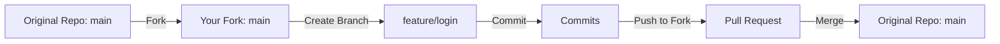

# 🛡️ SentinelR: AI-Enhanced Windows System Auditor

A cross-functional project that combines PowerShell, R, and RShiny to scan, analyze, and visualize real-time Windows system performance and security health — built to be usable by both technical and non-technical users.

---

## 📌 Table of Contents

* [📖 Summary](#📖-summary)
* [🚀 Features](#🚀-features)
* [📦 Tech Stack](#📦-tech-stack)
* [📚 Installed Packages](#📚-installed-packages)
* [🧠 Why This Matters](#🧠-why-this-matters)
* [🔧 PowerShell Audit Script](#🔧-powershell-audit-script)
* [🧪 RShiny Dashboard Code](#🧪-rshiny-dashboard-code)
* [📁 File Structure](#📁-file-structure)
* [📝 UTF-8 Compatibility Fix](#📝-utf-8-compatibility-fix)
* [✅ Conclusion](#✅-conclusion)
* [🧭 Forking Workflow Diagram](#🧭-forking-workflow-diagram)

---

## 📖 Summary

**SentinelR** is a mini platform that performs a real-time audit of your Windows system using PowerShell, transforms that data into structured JSON, then renders it in an interactive RShiny dashboard.

It’s built to help:

* 🧑‍💻 New developers learn real-world scripting, parsing, and UI-building
* 🧠 Data scientists visualize local system health without needing sysadmin tools
* 📊 Non-technical stakeholders gain insight into machine status

---

## 🚀 Features

✔️ Automated system scan with PowerShell
✔️ Clean JSON output for interoperability
✔️ Interactive web dashboard via RShiny
✔️ Visual tabs for CPU, Services, Defender, Tasks
✔️ PowerBI-style dark UI with Bootstrap 5
✔️ Manual refresh button and status display

---

## 📦 Tech Stack

* **PowerShell** – for system-level data extraction
* **R** – for transforming and analyzing the data
* **RShiny** – for live dashboard rendering
* **JSON** – for moving structured data between layers

---

## 📚 Installed Packages

* `jsonlite` – parse PowerShell JSON output
* `DT` – render interactive tables
* `bslib` – style dashboard with Bootstrap 5
* `shiny` – serve live dashboard app

---

## 🧠 Why This Matters

In today’s AI-powered workplace, it’s not enough to gather raw system data. You need to make it **visual**, **readable**, and **actionable** for both technical and non-technical users.

**SentinelR** is a model of how automation, AI, and visualization can bring clarity to system monitoring.

It’s perfect for:

* IT admins getting visibility without Task Manager
* Analysts tracking system metrics in real-time
* Developers embedding GPT tools for alerts and fixes

---

## 🔧 PowerShell Audit Script

Save as: `powershell/sentinel-audit.ps1`

```powershell
$homeFolder = [Environment]::GetFolderPath("MyDocuments")
$projectRoot = Join-Path $homeFolder "SentinelR"
$outputPath = Join-Path $projectRoot "output"

if (!(Test-Path $outputPath)) {
    New-Item -Path $outputPath -ItemType Directory -Force | Out-Null
}

$report = @{}

$report["HighCPUProcesses"] = Get-Process |
    Where-Object { $_.CPU -gt 200 } |
    Select-Object Name, Id, CPU

$report["AutoServicesNotRunning"] = Get-Service |
    Where-Object { $_.StartType -eq 'Automatic' -and $_.Status -ne 'Running' } |
    Select-Object Name, Status

$report["ScheduledTasks"] = Get-ScheduledTask |
    Select-Object TaskName, State

try {
    $defender = Get-MpComputerStatus
    $report["Defender"] = $defender | Select-Object AMServiceEnabled, RealTimeProtectionEnabled, AntispywareEnabled
} catch {
    $report["Defender"] = @{ Error = "Defender data not available on this system." }
}

$timestamp = Get-Date -Format "yyyyMMdd_HHmmss"
$filename = "sentinel_report_$timestamp.json"
$outputFile = Join-Path $outputPath $filename

# ✅ UTF-8 Safe Write
$json = $report | ConvertTo-Json -Depth 5
[System.IO.File]::WriteAllText($outputFile, $json, [System.Text.Encoding]::UTF8)

Write-Output "✅ Audit complete. File saved to:"
Write-Output $outputFile
```

---

## 🧪 RShiny Dashboard Code

Save as: `R/app.R`

```r
library(shiny)
library(jsonlite)
library(DT)
library(bslib)

# Load latest JSON file
get_latest_json <- function() {
  output_dir <- file.path(Sys.getenv("USERPROFILE"), "Documents", "SentinelR", "output")
  json_files <- list.files(output_dir, pattern = "sentinel_report_.*\\.json$", full.names = TRUE)
  if (length(json_files) == 0) return(NULL)
  json_files[which.max(file.info(json_files)$mtime)]
}

# Load theme (PowerBI-style dark)
dark_theme <- bs_theme(
  version = 5,
  bootswatch = "darkly",
  base_font = font_google("Roboto")
)

ui <- fluidPage(
  theme = dark_theme,
  tags$head(
    tags$style(HTML(".title-card {background-color: #212529;color: #F8F9FA;border-left: 6px solid #28a745;padding: 15px;margin-bottom: 20px;border-radius: 10px;} .file-info {color: #6c757d;font-size: 0.9em;margin-bottom: 15px;}"))
  ),

  div(class = "title-card",
      h2("🛡️ SentinelR Dashboard"),
      p("AI-Enhanced Windows System Auditor")
  ),

  div(class = "file-info", textOutput("file_path")),
  actionButton("refresh", "🔄 Refresh Data"),
  br(), br(),

  tabsetPanel(
    tabPanel("🧠 Defender Status", DTOutput("defender")),
    tabPanel("🔥 High CPU Processes", DTOutput("high_cpu")),
    tabPanel("🔧 Auto Services Not Running", DTOutput("auto_services")),
    tabPanel("⏰ Scheduled Tasks", DTOutput("tasks"))
  )
)

server <- function(input, output, session) {
  current_data <- reactiveVal()
  current_file <- reactiveVal()

  load_data <- function() {
    file <- get_latest_json()
    if (!is.null(file)) {
      json <- fromJSON(file)
      current_data(json)
      current_file(file)
    }
  }

  observeEvent(input$refresh, load_data, ignoreInit = TRUE)
  load_data()

  output$file_path <- renderText({
    req(current_file())
    paste("Last loaded:", basename(current_file()))
  })

  output$defender <- renderDT({
    req(current_data())
    datatable(as.data.frame(current_data()$Defender), options = list(pageLength = 5))
  })

  output$high_cpu <- renderDT({
    req(current_data())
    datatable(current_data()$HighCPUProcesses, options = list(pageLength = 10))
  })

  output$auto_services <- renderDT({
    req(current_data())
    datatable(current_data()$AutoServicesNotRunning, options = list(pageLength = 10))
  })

  output$tasks <- renderDT({
    req(current_data())
    datatable(current_data()$ScheduledTasks, options = list(pageLength = 10))
  })
}

shinyApp(ui = ui, server = server)
```

---

## 📁 File Structure

```
sentinelr-ai-auditor/
├── powershell/
│   └── sentinel-audit.ps1
├── R/
│   └── app.R
├── output/
│   └── sentinel_report_<timestamp>.json
├── README.md
```

---

## 📝 UTF-8 Compatibility Fix

PowerShell’s default output uses UTF-16 encoding, which can cause parsing errors in R. This script uses explicit UTF-8:

```powershell
[System.IO.File]::WriteAllText($outputFile, $json, [System.Text.Encoding]::UTF8)
```

---

## ✅ Conclusion

This project combines PowerShell scripting, structured JSON output, and RShiny dashboarding in a professional-grade app.

Whether you’re learning automation, building dashboards, or enabling smarter diagnostics — **SentinelR** shows how DevOps, data, and design can come together.

---

## 🧭 Forking Workflow Diagram




